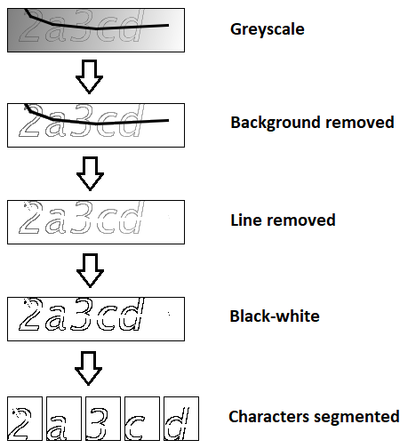
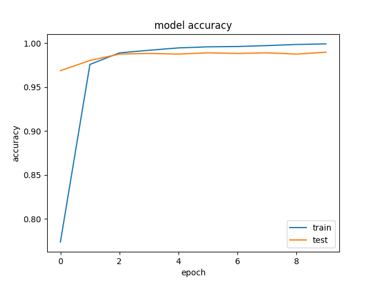
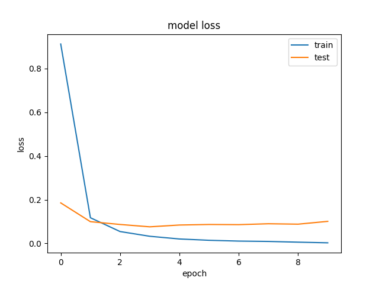

# Deep Learning Based CAPTCHA Solver

CAPTCHA stands for Completely Automated Public Turing test to tell Computers and Humans Apart. CAPTCHA determines whether the user is real or a spam robot. Automatic decoding of CAPTCHA is a critical issue for web scraping. The purpose of this deep learning based CAPTCHA solver is to automate scraping of a particular website. 


## Dataset Description

The dataset consists of 1862 PNG images of text based CAPTCHA. 1490 images have been used for training and the remaining images for testing purpose. Each image is of 5 character set and the character set is defined as all English small letters and digits. The dimensions of the CAPTCHA images are 50x200. The images consist of noise in the form of bold lines crossing characters.


## Preprocessing

Noise removal and character segmentation are the two main steps in preprocessing of CAPTCHA images. 

First, the RGB image is converted to a greyscale image; all pixel values are in the range 0–255. Next, the background color is converted to white by detecting character boundaries (detecting changes in RGB values for each pixel in a column). 

Once the image is converted to greyscale and background is converted to white, the next step is removing noise. As mentioned earlier, a bold line is present in the image that is crossing characters. Lines are removed from images by converting RGB values < 10 are converted to 255 (white). Next, the images are converted to black-white by converting RGB values < 255 to 0 (black).

The last step in preprocessing is character segmentation. The individual characters are segmented out of the image in order to train a model on the character classification task. The characters are mostly non-intersecting. But, there are some few cases that characters are touching each other. The segmentation step is the most challenging step in preprocessing and tried to be clarified in code comments. 

Preprocessing steps are illustrated below.



## Model

The model developed for the CAPTCHA solver uses Convolutional Neural Network. It consists of the input, convolutional, max pooling, flatten, dropout and dense layers. An Adam optimizer is used with cross-entropy loss. A validation split of 0.2 is used. While the model was trained with 10 epochs, the model typically converged in 5 epochs. All character images passed into the network are size 40x50x1. The accuracy obtained after 10 epochs is 0.99.





```bash
 1/56 [..............................] - ETA: 6s - loss: 6.1056e-06 - accuracy: 1.0000
 4/56 [=>............................] - ETA: 1s - loss: 1.3610e-04 - accuracy: 1.0000
 7/56 [==>...........................] - ETA: 1s - loss: 5.9785e-04 - accuracy: 1.0000
 9/56 [===>..........................] - ETA: 1s - loss: 6.9698e-04 - accuracy: 1.0000
11/56 [====>.........................] - ETA: 1s - loss: 6.0570e-04 - accuracy: 1.0000
13/56 [=====>........................] - ETA: 1s - loss: 5.6109e-04 - accuracy: 1.0000
15/56 [=======>......................] - ETA: 1s - loss: 5.1244e-04 - accuracy: 1.0000
17/56 [========>.....................] - ETA: 1s - loss: 4.5460e-04 - accuracy: 1.0000
20/56 [=========>....................] - ETA: 1s - loss: 0.0209 - accuracy: 0.9984    
22/56 [==========>...................] - ETA: 0s - loss: 0.0232 - accuracy: 0.9972
24/56 [===========>..................] - ETA: 0s - loss: 0.0213 - accuracy: 0.9974
26/56 [============>.................] - ETA: 0s - loss: 0.0196 - accuracy: 0.9976
29/56 [==============>...............] - ETA: 0s - loss: 0.0520 - accuracy: 0.9957
32/56 [================>.............] - ETA: 0s - loss: 0.0473 - accuracy: 0.9961
34/56 [=================>............] - ETA: 0s - loss: 0.0445 - accuracy: 0.9963
36/56 [==================>...........] - ETA: 0s - loss: 0.0443 - accuracy: 0.9957
38/56 [===================>..........] - ETA: 0s - loss: 0.0525 - accuracy: 0.9942
40/56 [====================>.........] - ETA: 0s - loss: 0.0579 - accuracy: 0.9937
42/56 [=====================>........] - ETA: 0s - loss: 0.0821 - accuracy: 0.9926
45/56 [=======================>......] - ETA: 0s - loss: 0.0862 - accuracy: 0.9924
46/56 [=======================>......] - ETA: 0s - loss: 0.0843 - accuracy: 0.9925
47/56 [========================>.....] - ETA: 0s - loss: 0.0914 - accuracy: 0.9914
49/56 [=========================>....] - ETA: 0s - loss: 0.0932 - accuracy: 0.9911
50/56 [=========================>....] - ETA: 0s - loss: 0.0914 - accuracy: 0.9912
52/56 [==========================>...] - ETA: 0s - loss: 0.0881 - accuracy: 0.9916
53/56 [===========================>..] - ETA: 0s - loss: 0.0887 - accuracy: 0.9912
56/56 [==============================] - ETA: 0s - loss: 0.0850 - accuracy: 0.9915
56/56 [==============================] - 2s 39ms/step - loss: 0.0850 - accuracy: 0.9915

Test loss: 0.08501605689525604

Test accuracy: 0.991530179977417

Labels:

 {'2': 0, '3': 1, '4': 2, '5': 3, '6': 4, '7': 5, '8': 6, 'a': 7, 'b': 8, 'c': 9, 'd': 10, 'e': 11, 'f': 12, 'g': 13, 'h': 14, 'k': 15, 'm': 16, 'n': 17, 'p': 18, 'r': 19, 'w': 20, 'x': 21, 'y': 22}

Confusion Matrix:

 tf.Tensor(
[[74  0  0  0  0  0  0  0  0  0  0  0  0  0  0  0  0  0  0  0  0  0  0]
 [ 0 80  0  0  0  0  0  0  0  0  0  0  0  0  0  0  0  0  0  0  0  0  0]
 [ 0  0 83  0  0  0  0  0  0  0  0  0  0  0  0  0  0  0  0  0  0  0  0]
 [ 0  0  0 78  0  0  0  0  0  0  0  0  0  0  0  0  0  0  0  0  0  0  0]
 [ 0  0  0  0 78  0  0  0  0  0  0  0  0  0  0  0  0  0  0  0  0  0  0]
 [ 0  0  0  0  0 77  0  0  0  0  0  0  0  0  0  0  0  0  0  0  0  0  0]
 [ 0  0  0  0  0  0 75  0  0  0  0  0  0  0  0  0  0  0  0  0  0  0  0]
 [ 0  0  0  0  0  0  0 77  0  0  0  0  0  0  0  0  0  0  0  0  0  0  0]
 [ 0  0  0  0  0  0  0  0 78  0  0  0  0  0  0  0  0  1  1  0  0  0  0]
 [ 0  0  0  0  0  0  0  0  0 82  0  0  0  0  0  0  0  0  0  0  0  0  0]
 [ 0  0  0  0  0  0  0  0  0  0 76  0  0  0  0  0  0  0  0  0  0  0  0]
 [ 0  0  0  0  0  0  0  0  0  0  0 67  0  0  0  0  1  0  0  1  0  0  0]
 [ 0  0  0  0  0  0  0  0  0  0  0  0 64  0  0  0  0  0  0  0  0  0  0]
 [ 0  0  0  0  0  0  0  0  0  0  0  0  0 82  0  0  0  0  0  0  0  0  0]
 [ 0  0  0  0  0  0  0  0  0  0  0  0  0  0 74  0  0  1  0  0  0  0  0]
 [ 0  0  0  0  0  0  0  0  1  0  0  0  1  0  0 78  0  0  0  0  0  0  0]
 [ 0  0  0  0  0  0  0  0  0  0  0  0  0  0  0  0 70  1  0  0  0  0  1]
 [ 0  0  0  0  0  0  0  0  0  0  0  0  0  0  0  0  1 83  0  0  0  0  0]
 [ 1  0  0  0  0  0  0  0  0  0  0  0  0  0  0  0  0  0 76  0  0  0  0]
 [ 0  0  0  0  0  1  0  0  0  0  0  0  0  0  0  0  1  0  0 73  0  0  0]
 [ 0  0  0  0  0  0  0  0  0  0  0  0  0  0  0  0  0  0  0  0 79  0  1]
 [ 0  0  0  0  0  0  0  0  0  0  0  0  0  0  0  0  0  0  0  0  0 74  0]
 [ 0  0  0  0  0  0  1  0  0  0  0  0  0  0  0  0  0  0  0  0  0  0 78]], shape=(23, 23), dtype=int32)
```

## Usage

```python
import os
from pathlib import Path

from catpcha_decoder import decode_captcha

base_dir = Path(__file__).resolve().parent
filepath = os.path.join(base_dir, 'img', '2a3cd.png')
model_path = os.path.join(base_dir, 'model_2021_11_07.h5')

captcha = decode_captcha(filepath, model_path)
print('Decoded Captcha:', captcha)
```